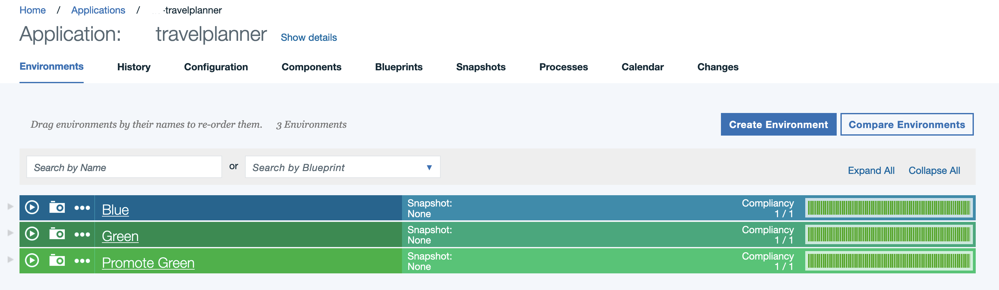

#This chart is to demonstrate use of Blue/Green deployment strategy using UrbanCode Deploy

It uses following primary resources:

1. Values.yaml represents the values for Blue helm chart
2. Values.green.yaml represents the values for Green helm chart
3. Values.promote.yaml [Optional] represents the value to switch hosts between blue/green pods
4. service-prod: Serves the production traffic.
5. service-stage: Uased for test traffic.
6. Ingress: NGINX ingress controller - Based on HostName routes production traffic to service-prod, and test traffic to service-stage.
7. service-lb: loadbalances traffic from outside to Ingress.
8. Deployments [Simple NGINX Server]
   5.1 deployment-blue:
   5.2 deployment-green:
   Both deployment yamls are identical : except for they target different slots[i.e. blue or green. Slot is virtual concept realized by attaching label slot=blue|green to the pods, Service routed traffic to pods based on the slot value]. Which one to deploy is controlled by variables blue.enabled & green.enabled.
9. travelplanner-ucd-application.json represents UrbanCode Deploy Application example to import in your environment

**Automated Blue/Green Deployment using UCD**

- We have modified the helm chart template to only deploy the Blue helm chart (previously, both green and blue deployed)
- We have seperated the Green release Values from Blue release to avoid adding both UCD properties in UCD Environments
- Promotion:
  - UCD [Promote Environment] will promote the traffic from Blue to Green release using UCD Promote Process
  - UCD [Promote Environment] will (de)-promote the traffic from Green to Blue release using UCD de-promote Process

**Youtube Video**

**Screenshots**

**Manual Blue/Green Deployment**
A key variable is productionSlot. Based on its value prod service is configured to route the traffic to that slot.

Following image is for the case when `productionSlot: blue`

_To Deploy the new release in green slot do following:_
`helm upgrade releasename repo/blue-green --set green.enabled=true --reuse-values`

After that following would be the state.[Green circles represent the pods created in green slot]:

_When testing is completed, and you are ready to promote this release to get Production traffic, run following command:_
`helm upgrade releasename repo/blue-green --set productionSlot=green --reuse-values`

After this, state will be as follows:

_If later, you want to delete the pods in blue slot [Optional], do following:_
`helm upgrade releasename repo/blue-green --set blue.enabled=false --reuse-values` (This step is not implemented in UCD)
Following will the state after it:

**Note**
Original chart and guide can be found here: https://github.com/puneetsaraswat/HelmCharts

Hope its useful. Happy Helming!!
